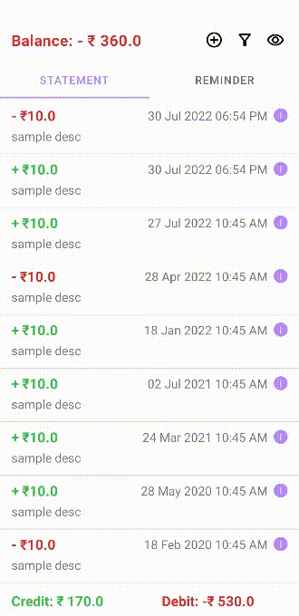

# CashFlow
A android app to track incomes and expenses. 

## Functions
- Add items (credit & debit)
- Delete items
- Update items
- Filter items by date range
- Change views
  - Individual
  - Weekly
  - Monthly
  - Yearly

## Future Work Items
1. Grouping Credits / Debits: 
   - Suppose you went on a trip to bangalore. Now you want to know the entire expenses on your trip. You can filter the expenses and then select / unselect the expenses and move them to another tap called grouped. The grouped tab shows a subset of your expenses from the main screen that you have tagged under the new title, in this case 'Bangalore Trip'. 

2. Pagination
   - Currently we are fetching the complete details in a single go. Optimize the database fetching process via pagination.

## Prototypes
- [Stable (main branch)](https://storage.googleapis.com/cashflow-fc29a.appspot.com/cashflow.apk)
- [Latest (develop branch)](https://storage.googleapis.com/cashflow-fc29a.appspot.com/cashflow-dev.apk)

## Demo
